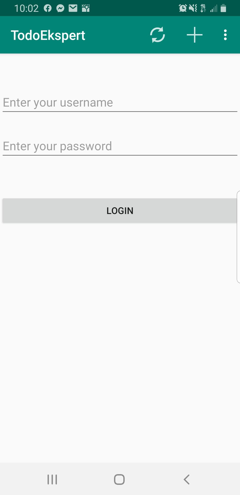
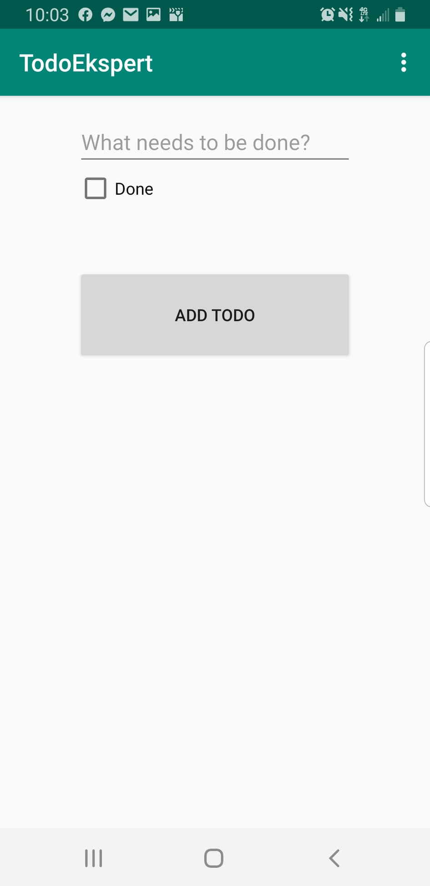

# TodoEkspert
Aplicación de múltiples activities para que se muestre que se guarda una nueva necesidad o tarea 

### Name
TodoEkspert

### Description
Esta aplicación es sobre una lista de tareas que inicia sesion y en la que agregas las necesidades o las tareas.

### Visuals

### Usage
Esta aplicación es para hacer una lista de tareas

### Roadmap

Mejorar el diseño de la aplicación para que se vea con mejor apariencia.

### Authors and acknowledgment

Daniela Cortez Zavala responsable de la creación de este proyecto

